# Sabikun Ethika

### Computer Science & Engineering Student | Full-Stack Developer

  

---

## About Me

I am a Computer Science and Engineering student interested in software development, problem solving, and building practical applications.

I enjoy turning ideas into working software and learning new technologies through hands-on projects. My current interests include full-stack web development, backend systems, databases, artificial intelligence, machine learning, and cybersecurity.

I believe in learning by building, understanding how systems work, and continuously improving through practical experience.

### Currently Working On

* Exploring modern full-stack development with Next.js and TypeScript
* Building web applications using React and backend technologies
* Working with REST APIs, authentication, databases, and server-side systems
* Practicing Data Structures and Algorithms
* Exploring Machine Learning and Explainable AI
* Working on academic and software development projects
* Improving problem-solving and software engineering skills

---

## Skills

### Programming Languages

  

### Frontend Development

  

### Backend Development

  

### Databases

  

### Tools and Technologies

  

---

## Projects

### GetTally

**Chat-Native Order and Earnings Tracker for Small Online Sellers**

GetTally is a chat-native, voice-first order and earnings tracking application designed for small online sellers. Instead of requiring sellers to manually enter every order into a separate system, GetTally allows them to paste Messenger conversations or record order information through voice.

Gemini analyzes pasted conversations and extracts relevant order information. The seller reviews and confirms the extracted information before it is saved, keeping the seller in control of the final order.

**Technology Stack**

* Next.js 16
* React 19
* TypeScript
* Tailwind CSS 4
* NestJS 12
* PostgreSQL
* Prisma 5
* Node.js Crypto
* Browser MediaRecorder API
* whisper.cpp
* FFmpeg
* Google Gemini REST API
* Jest
* ts-jest
* Git and GitHub

**Key Features**

* Seller registration and authentication
* Seller dashboard
* Product and order management
* Pasted Messenger conversation analysis
* AI-based order information extraction
* Voice-based order input
* Bangla, Banglish, and English speech transcription
* Local speech-to-text using whisper.cpp
* Seller confirmation before saving orders
* Revenue and profit tracking
* Returns tracking
* Monthly sales analysis
* Sales growth tracking
* Top-product analysis

**Note:** Messenger API integration is not currently implemented. Sellers can paste Messenger conversations into GetTally for AI analysis.

[View Repository](https://github.com/SabikunEthika/GetTally)

---

### CareMeds

**Healthcare E-Commerce and Medicine Management Platform**

CareMeds is a full-stack web application built around medicine and healthcare-related services. The platform provides functionality for browsing products, user authentication, online payments, order management, courier dispatch, and related services.

**Technology Stack**

**Frontend**

* React
* TypeScript
* Vite
* React Router
* React Bootstrap
* Axios
* Stripe React SDK
* jsPDF

**Backend**

* PHP
* Laravel 8
* Laravel Sanctum
* Laravel Socialite
* RESTful API architecture

**Database**

* MySQL

**External Services**

* Stripe for online payments
* Google OAuth for social authentication
* Resend / SMTP for email delivery
* Steadfast API for courier dispatch

[View Repository](https://github.com/SabikunEthika/CareMeds)

---

### Ed-Bridge

**An Integrated Digital Platform for Academic Resource Sharing and Student Collaboration**

Ed-Bridge is a full-stack academic platform that combines academic resource sharing, notes and materials, student discussions, posts, and collaboration into a single digital platform.

The project provides students with a centralized environment for sharing academic resources and interacting with other students.

**Technology Stack**

**Frontend**

* React
* React Router
* JavaScript
* CSS
* Create React App

**Backend**

* ASP.NET Core Web API
* .NET 10
* Entity Framework Core
* JWT Bearer Authentication
* Swagger / OpenAPI

**Database**

* MySQL / MariaDB
* Pomelo Entity Framework Core Provider

[View Repository](https://github.com/SabikunEthika/Ed-Bridge)

---

### GridWise BUP 2026

**Optimization and Decision-Support Application**

GridWise BUP 2026 is a software project developed for the BUP 2026 project showcase. It combines an API-based backend, data validation, generative AI integration, and mathematical optimization techniques to address a practical decision-making problem.

**Technology Stack**

* Python 3.11+
* FastAPI
* Uvicorn
* Pydantic v2
* Google Gemini
* google-genai
* PuLP
* COIN-OR CBC Solver
* Pytest
* HTTPX
* Docker
* Docker Compose

[View Repository](https://github.com/SabikunEthika/GridWise-BUP-2026)

---

### JobHut

**Location-Based Full-Stack Job Portal**

JobHut is a full-stack JavaScript job portal designed to connect job seekers and employers through a modern web platform.

The application includes job browsing, authentication, job-related interactions, file uploads, notifications, and backend services.

**Technology Stack**

**Frontend**

* React 19
* Vite
* Tailwind CSS 4
* React Router DOM
* Axios
* Quill
* React Toastify

**Backend**

* Node.js
* Express 5
* JavaScript

**Authentication**

* Clerk
* JWT
* bcrypt

**Database**

* MongoDB
* Mongoose

**Services and Infrastructure**

* Cloudinary
* Multer
* Sentry
* Svix
* Vercel

**Development Tools**

* ESLint
* Nodemon

[View Repository](https://github.com/SabikunEthika/JobHut)

---

## GitHub Contribution Streak

  

---

## Contribution Calendar

  

---

## Currently Learning

  
  
  
  
  

---

## Connect With Me

  

  

---

  <i>Building, learning, and improving one project at a time.</i>

